# StudioElf Bootswatch Theme Collection

⚙️ **Compatible with:** Oqtane Framework 10+

---

## Overview

The **StudioElf Bootswatch Theme Collection** is a fork and evolution of the original Oqtane Bootswatch themes — rebuilt to provide a clean, automated, and continuously updated set of themes powered by [Bootswatch](https://bootswatch.com/).

Each theme is dynamically generated and maintained through the `UpdateBootswatchThemes` tool, ensuring every release reflects the latest Bootswatch versions available on [cdnjs](https://cdnjs.com/libraries/bootswatch).

---

## ✨ What’s New in StudioElf

- 🔁 **Automated Theme Updates:**  
  A new tool (`Tools/UpdateBootswatchThemes`) fetches the latest Bootswatch metadata and regenerates all `ThemeInfo.cs` files with correct integrity hashes and version numbers.

- 🧱 **Automatic Theme Scaffolding:**  
  When a new Bootswatch theme (e.g., “Brite”) is added, the tool automatically:
  - Creates the required folder structure (`Containers` + `Themes`)
  - Generates default Razor components
  - Copies `default.css` → `<ThemeName>.css` in `wwwroot`

- 🧩 **Version Integration:**  
  The theme version now combines the Oqtane and Bootswatch versions (e.g., `6.5.3.8`), keeping both ecosystems in sync.

- 🚫 **Ignore List Support:**  
  You can exclude specific Bootswatch themes (e.g., “Cyborg”) from automatic updates.

---
## 🧩 About Oqtane Themes

A custom Oqtane theme is made up of **Razor components**, some of which inherit from:

- `ThemeBase` — defines page structure and layout (themes)
- `ContainerBase` — defines module containers (containers)

### 🧱 Theme Components
These provide the main layout and structure for your pages.  
They include theme controls such as `Menu`, `Login`, and `Pane` placeholders for module injection.

### 📦 Container Components
Containers wrap individual module instances and provide controls like `ModuleTitle` and `ModuleActions`.

### 🧩 ITheme Metadata
Each theme implements `ITheme`, providing metadata such as name, version, and static resource paths.

---

## 🧱 Inheritance Structure

To simplify maintenance, all individual themes (e.g., *Minty*, *Cosmo*, *Flatly*) **inherit** from the shared `Default` theme.  
This consolidates markup and CSS definitions into fewer files, reducing duplication and easing updates.

---

## 🖼️ Theme Previews

Below are some of the included Bootswatch styles:

| Theme | Preview |
|-------|----------|
| **Cerulean** | 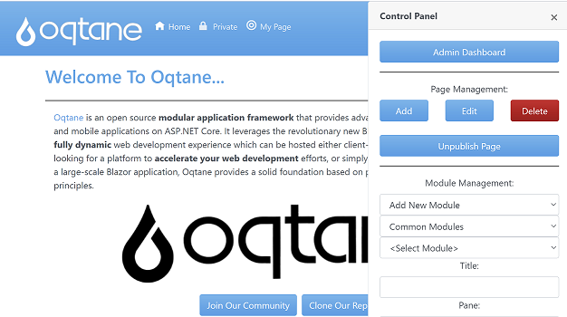 |
| **Cosmo** | 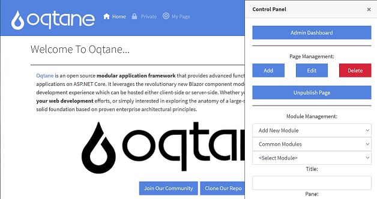 |
| **Darkly** | 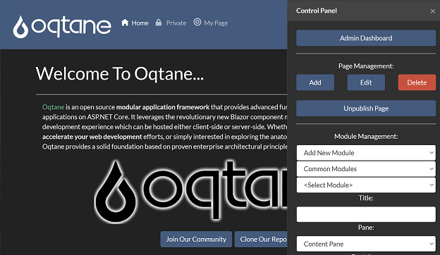 |
| **Flatly** | 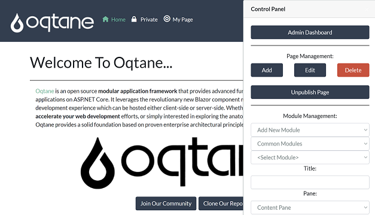 |
| **Journal** | 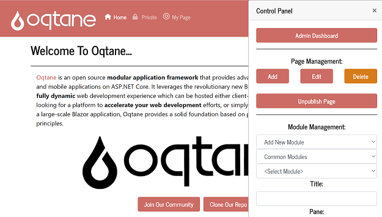 |
| **Litera** | 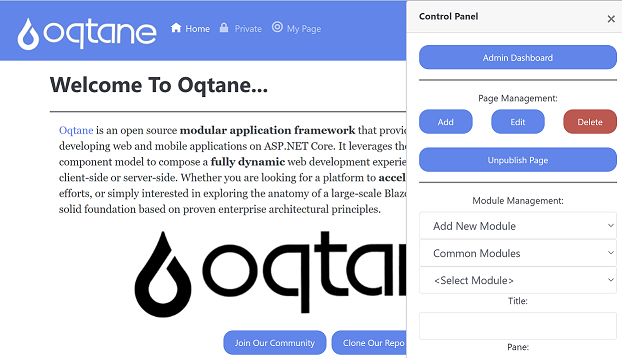 |
| **Lux** | 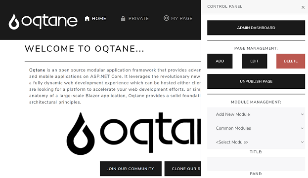 |
| **Materia** | 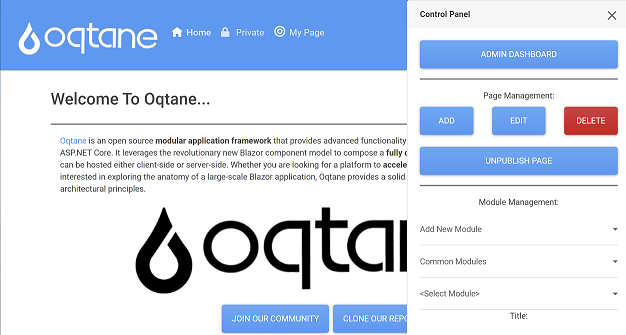 |
| **Minty** | 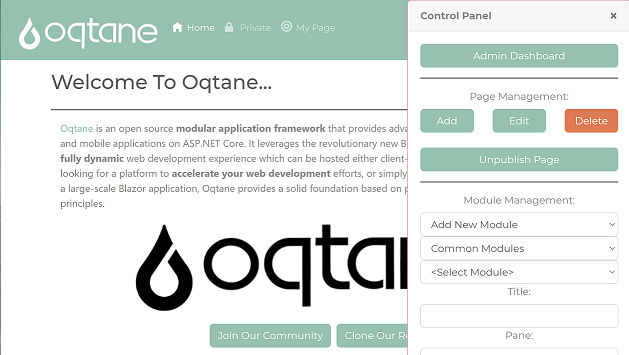 |
| **Pulse** | 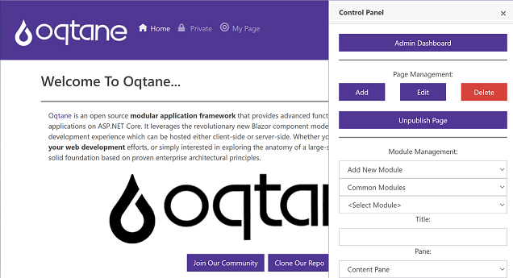 |
| **Quartz** | 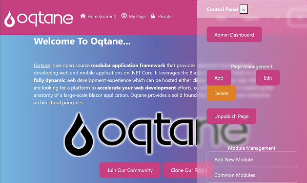 |
| **Slate** | 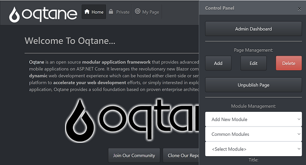 |
| **Superhero** | 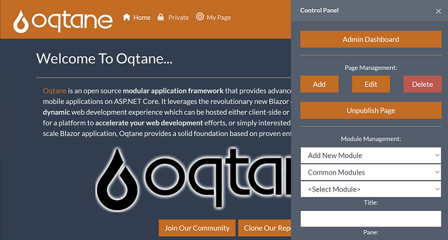 |
| **Vapor** | 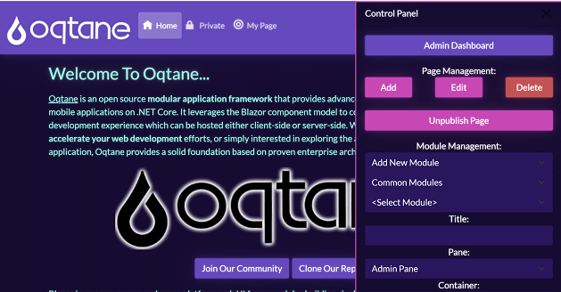 |
| **Yeti** | 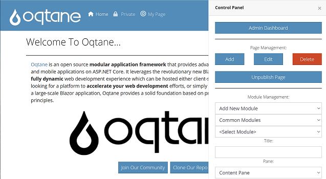 |
| **Zephyr** | 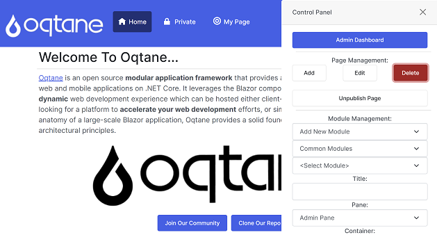 |

---

## ⚙️ Updating Themes

To refresh all themes to the latest Bootswatch version, run:

```bash
dotnet run --project Tools/UpdateBootswatchThemes/UpdateBootswatchThemes.csproj

This will:
- Fetch the latest Bootswatch release info from cdnjs
- Update all ThemeInfo.cs files
- Ensure missing Razor and CSS scaffolding is created
- Update the StudioElf.Theme.Bootswatch.nuspec version automatically

## Credits

- **Forked from:** [Oqtane Bootswatch Theme Collection](https://github.com/oqtane/oqtane.theme.bootswatch)
- **Maintained by:** [StudioElf](https://github.com/studioelf)
- **Theme Sources:** [Bootswatch.com](https://bootswatch.com)
- **Framework:** [Oqtane Framework](https://github.com/oqtane/oqtane.framework)

## License

This project is licensed under the [MIT License](LICENSE).
